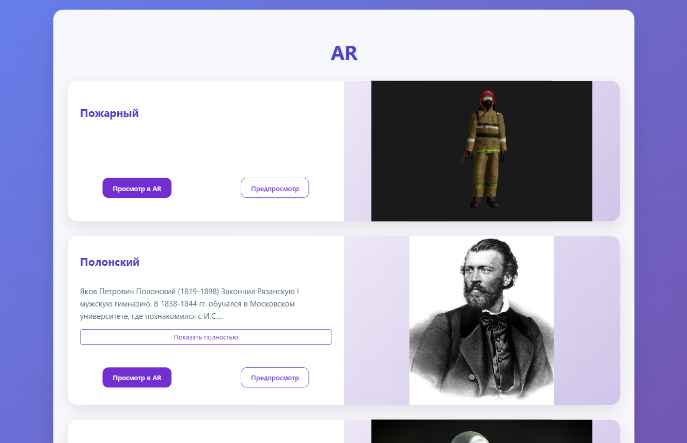

# ✨ Miracle AR

> Платформа для просмотра 3D-моделей в дополненной реальности с маркерным трекингом. Пользователи могут загружать модели, управлять контентом через админ-панель, просматривать модели в AR или 3D‑просмотрщике, а также просматривать привязанные видеоуроки.



## 📂 Репозиторий

- **Репозиторий:** [github.com/Sw1ftFox/miracle-ar](https://github.com/Sw1ftFox/miracle-ar)

## 📦 Стек технологий (фронтенд)

| Категория         | Технологии                                                      |
| ----------------- | --------------------------------------------------------------- |
| Язык / фреймворк  | React , TypeScript                                              |
| Сборка            | Vite                                                            |
| UI‑библиотека     | Ant Design , CSS Modules                                        |
| Стейт‑менеджмент  | Redux Toolkit                                                   |
| Маршрутизация     | React Router                                                    |
| HTTP‑клиент       | Fetch API                                                       |
| 3D / AR           | Three.js, @react-three/fiber, @react-three/drei, A‑Frame, AR.js |
| Сжатие 3D-моделей | Meshoptimizer + @gltf-transform                                 |
| CI/CD             | GitHub Actions + Docker                                         |
| Хостинг           | Vercel                                                          |

## ✨ Основные возможности

- **Просмотр 3D-моделей в AR** – маркерный трекинг через камеру (A-Frame + AR.js).
- **3D-просмотрщик (превью)** – вращение модели мышью, масштабирование (Three.js).
- **Админ-панель** – управление моделями, маркерами, звуками, изображениями, описаниями и видео.
- **Загрузка файлов** – поддержка GLB, PNG/JPG, MP3, TXT, MP4/WEBM/MOV.
- **Сжатие 3D-моделей** – опция сжатия Meshopt (с выбором уровня) для ускорения загрузки.
- **Видеоуроки** – привязка видео к моделям, встроенный плеер.
- **Адаптивный дизайн** – мобильная и десктопная версии, отдельные Layout’ы для обычного UI и AR.
- **Защищённые маршруты** – авторизация для доступа к админ-панели.
- **Ленивая загрузка** – компоненты страниц (`async`) для уменьшения начального бандла.
- **Обработка ошибок** – Error Boundaries, лоадеры, уведомления об успехе/ошибке.

## 🛠️ Установка и запуск (фронтенд)

```bash
git clone https://github.com/Sw1ftFox/miracle-ar.git
cd miracle-ar/apps/frontend
npm install
npm run dev
```

## 🛠️ Установка и запуск (бэкенд)

```bash
git clone https://github.com/Sw1ftFox/miracle-ar.git
cd miracle-ar/apps/backend
.\mvnw spring-boot:run
```

## 📂 Структура фронтенд части проекта (основные модули)

```
apps/frontend/
├── public/               # Статика (index.html, ar-scene.html, vendor/ с A‑Frame)
├── src/
│   ├── app/              # Глобальные провайдеры, layouts, роутинг, store RTK
│   ├── features/         # Слайсы Redux (auth, filesManagment, modelManagment)
│   ├── pages/            # Страницы (ленивые) – Admin, ARViewer, Auth, Models, ModelViewer, NotFound
│   ├── shared/           # UI‑компоненты, хуки, утилиты, конфиги
│   │   ├── ui/           # (Loader, PageLoader, ProtectedRoute, UploadStatus, CompressionOptions, VideoPlayer...)
│   │   └── utils/        # compressModel, StorageService, removeFileExtension
│   ├── widgets/          # Крупные компоненты (ARScene, ModelCanvas, Section, FilesList, ModelItem...)
│   ├── index.css
│   └── main.tsx
├── Dockerfile            # Сборка фронтенда для деплоя
├── vite.config.ts
├── package.json
└── tsconfig.json
```
